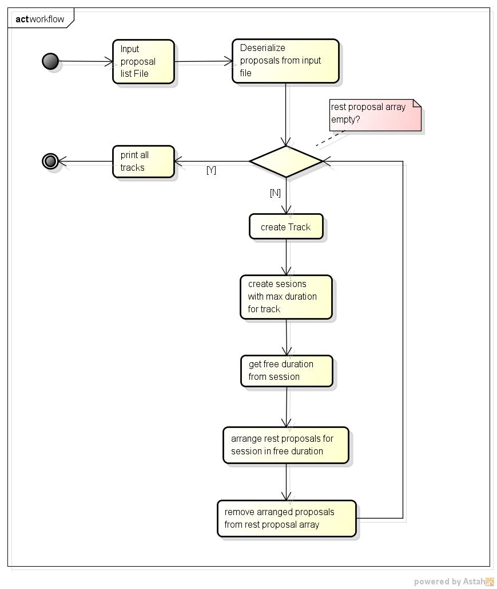
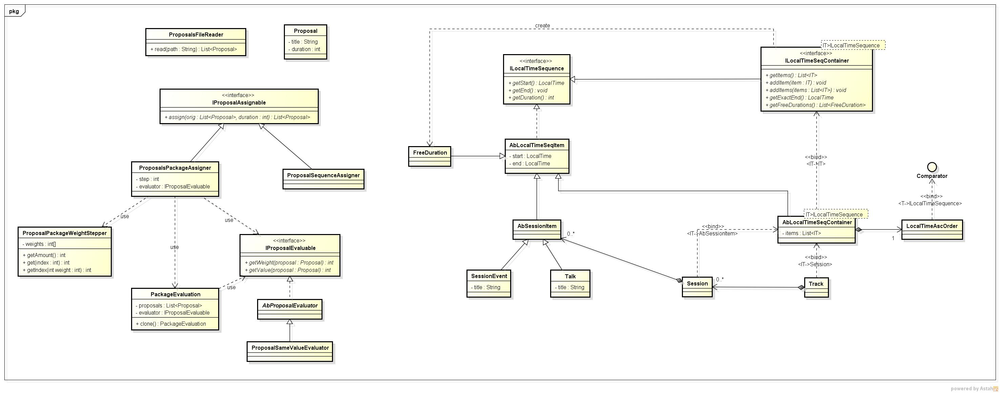

# Conference Track Management


## Environment

- Java 8
- JUnit 4
- maven 3.5.2

Make sure you have configured Java and maven in **path**,
it should be run java and maven directly in shell/cmd.

## How to Run

### Run application

1. open a shell/cmd 
2. cd root directory of source code, it contains a **pom.xml**
3. run below commands to build jar file in **target** directory
```
<!-- build source code for executable jar file -->
$ mvn clean package -Dmaven.test.skip=true
```
4. execute jar file, we prepare a test proposal input file 
in **src\test\resources\proposals.txt**

``` 
interview.conferencetrack-1.0-SNAPSHOT.jar <proposal_input_file_path>

    - proposal_input_file_path, required, file path of proposal input file

<!-- example -->
$ cd target
$ java -jar interview.conferencetrack-1.0-SNAPSHOT.jar ..\src\test\resources\proposals.txt

```

### Run test cases

1. open a shell/cmd 
2. cd root directory of source code, it contains a **pom.xml**
3. run below commands to run test cases
```
$ mvn test
```
4. you can find reports under **target\surefire-reports**

## Design

**Elements Description**


- FreeDuration, represent free time which could be arranged
- SessionItem, represent activity which need take some time, 
such as talk, event(**lunch, networking event**) and so on.
- Session, SessionItem container
- Track, Session Container, represent one day time line

**Draft workflow**



**Main Models Design**



- ILocalTimeSequence, represent actions of item which have start time and end time
- ILocalTimeSeqContainer, ILocalTimeSequence container, 
such as **Session, Track**
- AbSessionItem, only used for Session, represent activiy or event.
- ProposalsFileReader, read proposals from file and convert to Proposal object
- IProposalAssignable, collect proposals into specific **FreeDuration**
